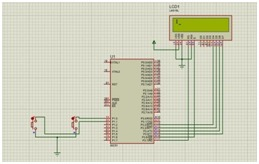
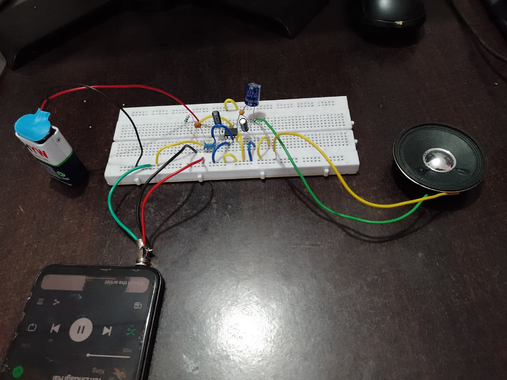
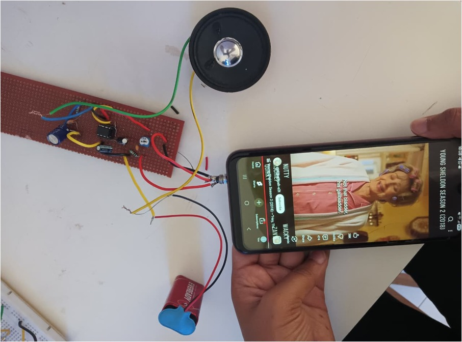

# LM386 Audio Amplifier Design

## Overview

This project implements a low-voltage Class-AB audio amplifier using the LM386 IC. The design was simulated in Proteus and validated through waveform analysis, breadboard implementation, and PCB realization, demonstrating reliable amplification for driving an 8Ω speaker.

---

## Objective

To design and verify an LM386-based audio amplifier capable of amplifying low-level input signals into audible output with stable gain and minimal noise.

---

## System Description

The amplifier uses the LM386 IC powered by a 9V supply. The design includes:

* Input coupling for signal conditioning
* Gain control using external capacitor configuration
* Bypass and decoupling capacitors for noise reduction
* Output coupling to drive an 8Ω speaker

---

## Tools Used

* Proteus (circuit simulation and waveform analysis)
* Breadboard (hardware implementation)
* PCB design and fabrication

---

## Simulation Setup (Proteus)

The circuit was simulated in Proteus to verify amplification behavior and stability before hardware implementation.

---

## Hardware Implementation (Breadboard)

The amplifier was implemented on a breadboard to validate real-time performance.

---
## Waveform Analysis

The waveform shows the amplified output signal compared to the input, confirming effective voltage gain with minimal distortion.

## PCB Design

A PCB layout was designed and fabricated to ensure stable connections and compact implementation.

---

## Key Observations

* Stable voltage gain achieved using proper capacitor configuration
* Noise minimized through bypass and decoupling techniques
* Output successfully drives an 8Ω speaker
* Consistent performance observed across simulation and hardware

---

## Conclusion

The LM386-based amplifier was successfully designed, simulated in Proteus, and implemented on both breadboard and PCB. The system demonstrates reliable amplification suitable for low-power audio applications.

---

## Future Improvements

* Noise optimization for improved audio clarity
* Compact PCB design for portable applications
* Integration with real audio input sources
